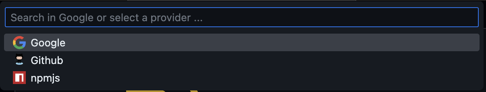

# Fast Search

A VS Code extension that provides a fast way to begin search within VSCode and continues in the browser.

## Usage

Run command or `ctrl/cmd + k, ctrl/cmd + q`

Search in Google, or select a search provider then search in it.

Search engine list is provided by [search-engine-collection](https://github.com/yujianghao/search-engine-collection).

[Click here to see engine list or add one](https://github.com/yujianghao/search-engine-collection#engine-list)

## License

[MIT](./LICENSE) License © 2023 [Yu Jianghao](https://github.com/yujianghao)
